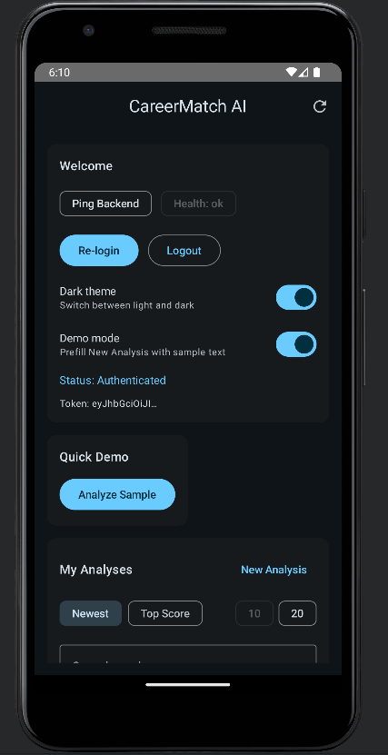
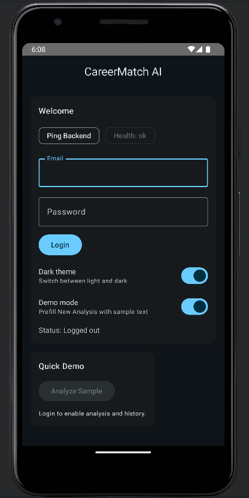
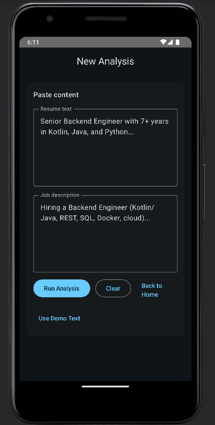
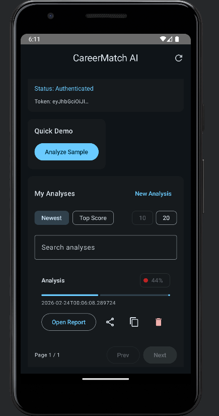

# CareerMatch AI

CareerMatch AI is a full-stack mobile app that helps job seekers compare a resume to a target job description and get actionable feedback before applying.

This capstone demonstrates end-to-end delivery across Android, API design, authentication, persistence, and testing.

## Quick Demo

- Live API: `https://d424-software-engineering-capstone-tdvq.onrender.com`
- Swagger docs: `https://d424-software-engineering-capstone-tdvq.onrender.com/docs`
- HTML report: `GET /reports/{analysis_id}`

Fastest walkthrough:
1. Open Swagger docs.
2. Login with the demo account.
3. Call `POST /analyze`.
4. Open `GET /reports/{analysis_id}` in a browser.

## Screenshots

Main dashboard:


Login:


Analysis input:


Results (lower section):


## Problem

Job seekers often tailor resumes manually and struggle to identify missing skills for a role.

CareerMatch AI reduces that friction by extracting and comparing resume/job keywords, calculating a readiness score, and returning prioritized suggestions. It also preserves analysis history for iteration.

## Highlights

- JWT auth for protected endpoints.
- Weighted keyword analysis with structured skill output.
- Readiness scoring + prioritized suggestions.
- Analysis history with pagination, search, sorting, and deletion.
- Shareable HTML and CSV report exports.
- Android app in Jetpack Compose for login, analysis, and history.
- Pull-to-refresh, deep-link/report sharing, and persistent preferences.

## Tech Stack

- Frontend: Kotlin, Jetpack Compose, Retrofit, Room, DataStore
- Backend: Python, FastAPI, SQLAlchemy, Pydantic
- Data: SQLite (dev), PostgreSQL-compatible config (deployment)
- Auth: JWT (`python-jose`), `passlib`
- Testing: Pytest (backend), JUnit/Android tests (frontend)
- Deployment: Dockerized backend (Render)

## Architecture

- `frontend/`: Android client (UI, ViewModel, repository, local preferences)
- `backend/`: FastAPI service (auth, analysis, persistence, reports)
- `firebase_site/`: static hosting scaffold

See `ARCHITECTURE.md` for a diagram and data flow details.

High-level flow:
1. User logs in from Android app.
2. App stores token and calls protected endpoints.
3. `/analyze` computes skills/suggestions and stores analysis rows.
4. App fetches history from `/analyses`.
5. Reports are opened/shared via `/reports/{analysis_id}`.

## API Snapshot

- `GET /health`
- `POST /auth/login`
- `POST /analyze`
- `GET /analyses`
- `GET /analyses/{analysis_id}`
- `DELETE /analyses/{analysis_id}`
- `GET /reports/{analysis_id}`
- `GET /reports/{analysis_id}/csv`

## Scope (Individual Capstone)

- Full API design and implementation.
- Analysis engine with extensibility hooks (keyword now, semantic later).
- Auth, persistence model, and report rendering.
- Android UI flows and state management.
- Automated tests for analyzer behavior and API flows.

## Run Locally

Prerequisites:
- Python 3.11+
- Android Studio
- JDK 17

Backend:
```bash
cd backend
python -m venv .venv
source .venv/bin/activate
pip install -r requirements.txt

export DATABASE_URL=sqlite:///./career_match_ai.db
export JWT_SECRET=change-me
export DEMO_EMAIL=demo@example.com
export DEMO_PASSWORD=Password123!

uvicorn app.main:app --reload
```

API runs at `http://127.0.0.1:8000` with docs at `/docs`.

Frontend (Android):
```bash
cd frontend
./gradlew assembleDebug
```

Then open `frontend/` in Android Studio and run on an emulator/device.

Note: `BASE_URL` points to the deployed backend. Update `frontend/app/src/main/java/com/example/careermatchai/data/remote/RetrofitProvider.kt` to target a local backend.

## Testing

Backend:
```bash
cd backend
pytest -q
```

Frontend:
```bash
cd frontend
./gradlew test
./gradlew connectedAndroidTest
```

Manual/acceptance coverage is documented in `TEST_PLAN.md`.

## Engineering Decisions

- FastAPI + Pydantic for typed contracts and quick iteration.
- SQLAlchemy for portable persistence and clean boundaries.
- JWT bearer auth to model protected-resource flows.
- Compose + ViewModel for reactive UI state.
- DataStore for user settings and UX continuity.

## Limitations and Next Steps

- Analyzer is keyword-based; next is semantic matching with embeddings.
- Demo credential store should be replaced with persistent user management.
- Pagination slices in memory after query; can be optimized with SQL-level pagination/count.
- CI and monitoring can be expanded.

## Recruiter Notes

This repo showcases:
- Full-stack ownership from product idea to deployed API.
- Mobile + backend integration.
- Practical engineering tradeoffs across security, data modeling, UX, and testing.

If helpful, I can provide:
- A 3–5 minute guided demo walkthrough.
- Architecture deep-dive and tradeoff discussion.
- Planned roadmap for production hardening.
